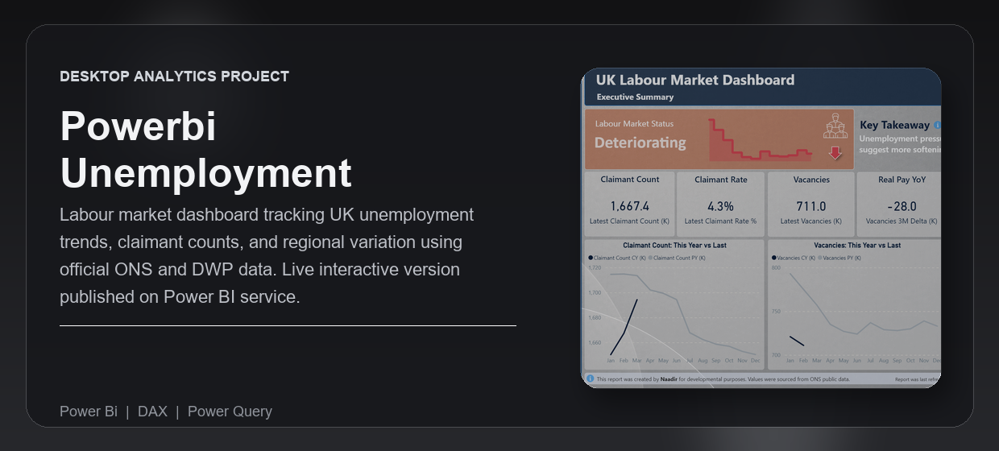

<div align="center">


<br /><br />

<p><strong>Labour market dashboard tracking UK unemployment trends, claimant counts, and regional variation using official ONS and DWP data. Live interactive version published on Power BI service.</strong></p>

<p>{One sentence on who this was built for and why it matters.}</p>

<p>
  <a href="#overview">Overview</a> |
  <a href="#what-problem-it-solves">What It Solves</a> |
  <a href="#feature-highlights">Features</a> |
  <a href="#screenshots">Screenshots</a> |
  <a href="#quick-start">Quick Start</a> |
  <a href="#tech-stack">Tech Stack</a>
</p>

<h3><strong>Made by Naadir | May 2026</strong></h3>

</div>

---

## Overview

{Two or three direct paragraphs explaining what the project does, the workflow it supports, and the practical outcome for the user.}

## What Problem It Solves

- {Pain point this removes}
- {Manual process this replaces or improves}
- {Decision, workflow, or visibility gap this makes clearer}
- {Why this solution is useful compared with the default/manual approach}

### At a glance

| Track | Analyse | Compare |
|---|---|---|
| {What the app tracks} | {What the app analyses} | {What can be compared side-by-side} |
| {Key input or state} | {Key metric or transformation} | {Baseline vs improved scenario} |
| {Export, save, or monitor flow} | {Chart/table/report output} | {Trade-off or scenario output} |

## Feature Highlights

- **{Feature area}**, {specific capability and why it matters}
- **{Feature area}**, {specific capability and why it matters}
- **{Feature area}**, {specific capability and why it matters}
- **{Feature area}**, {specific capability and why it matters}
- **{Feature area}**, {specific capability and why it matters}
- **{Feature area}**, {specific capability and why it matters}

### Core capabilities

| Area | What it gives you |
|---|---|
| **{Capability group}** | {Concrete user-facing outcome} |
| **{Capability group}** | {Concrete user-facing outcome} |
| **{Capability group}** | {Concrete user-facing outcome} |
| **{Capability group}** | {Concrete user-facing outcome} |

## Screenshots

<details>
<summary><strong>Open screenshot gallery</strong></summary>

<br />

<div align="center">
  
  <br /><br />
  
  <br /><br />
  
</div>

</details>

## Quick Start

```bash
# Clone the repo
git clone https://github.com/Naadir-Dev-Portfolio/PowerBI-Unemployment Dashboard.git
cd PowerBI-Unemployment Dashboard

# Install dependencies
{install command}

# Run
{run command}
```

{Add any first-run notes, required local files, API key notes, or state that no API keys are required.}

## Tech Stack

<details>
<summary><strong>Open tech stack</strong></summary>

<br />

| Category | Tools |
|---|---|
| **Primary stack** | `Language` |
| **UI / App layer** | {Frameworks, desktop UI, web UI, mobile UI, or CLI layer} |
| **Data / Storage** | {JSON, CSV, SQLite, files, APIs, cloud services, or none} |
| **Automation / Integration** | {External services, APIs, scripts, schedulers, or local integrations} |
| **Platform** | {Windows, macOS, Linux, Web, Android, iOS, or cross-platform} |

</details>

## Architecture & Data

<details>
<summary><strong>Open architecture and data details</strong></summary>

<br />

### Application model

{Explain the core flow: inputs -> processing/calculation/automation -> outputs. Keep it concrete and implementation-aware.}

### Project structure

```text
PowerBI-Unemployment Dashboard/
+-- {main entry file or folder}
+-- {supporting module or folder}
+-- README.md
+-- repo-card.png
+-- screens/
|   +-- screen1.png
+-- portfolio/
    +-- {project-slug}.json
    +-- {project-image}.webp
```

### Data / system notes

- {Persistence, file format, API, or processing note}
- {Security, local-only, offline, or environment note}
- {Export, logging, testing, or deployment note}

</details>

## Contact

Questions, feedback, or collaboration: `naadir.dev.mail@gmail.com`

<sub>Language</sub>
